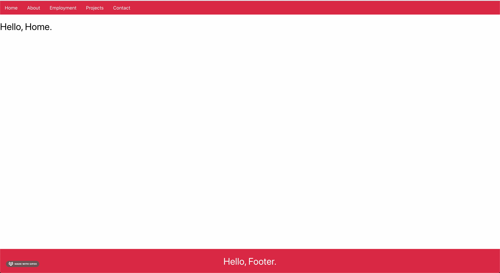
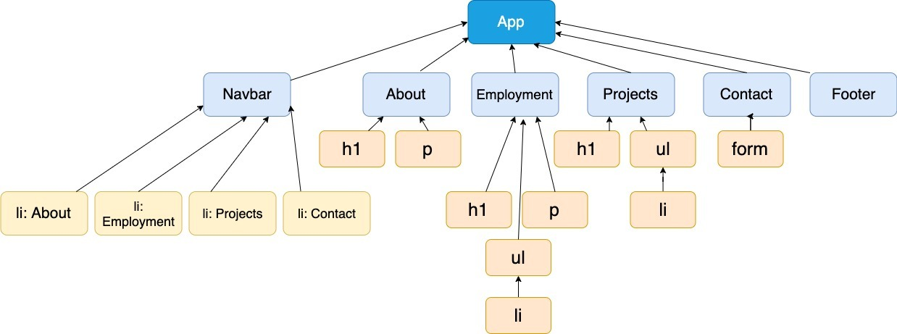

This project has been made to help with the creation of the digital portfolio.

Starting projects can be really tough, hopefully this will help you with the idea of how to create.

I'll be updating it with differnt features from react as we cover them.

- [x] React Router
- [ ] Props
- [ ] State

# Steps to create the site



## Our structure



1. Create a Navbar component and render that in the App.js
2. Go to https://www.npmjs.com/package/react-router-dom & https://reacttraining.com/react-router/ to advance your research and learning!
3. Install react-router-dom and import it inside of the Navbar.js like so:

```javascript
/**
 * inside the terminal: npm i react-router-dom
 */

import { BrowserRouter as Router, Switch, Link, Route } from 'react-router-dom';
```

4. Create a navigation bar inside of the Navbar component like so:

```javascript
return (
  <Router>
    <div>
      <ul>
        <li>
          <Link to='/'>Home</Link>
        </li>
      </ul>
      {/* what is the switch doing here? */}
      <Switch>
        <Route exact path='/'>
          <Home />
        </Route>
      </Switch>
    </div>
  </Router>
);
```

5. Notice that we don't have a 'Home' component. Let's create that now!

```javascript
import React from 'react';

const Home = () => {
  return (
    <div>
      <h1>Hello, Home.</h1>
    </div>
  );
};

export default Home;
```

That should solve our issue of Home is not defined.

6. Let's do the same for our next component: _About_

```javascript
import React from 'react';

const About = () => {
  return (
    <div>
      <h1>Hello, About.</h1>
    </div>
  );
};

export default About;
```

7. We now need to modify our Navbar.js to accomodate the new link:

```javascript
// we have created a new component and exported it. We need to ensure we now import it too.
import About from './About';

// Now, let's modify the navbar itself. Pay close attention to how we create Home and see if you can replicate it.
<li>
  <Link to='/about'>About</Link>
</li>
// hi there, make sure you focus on where you are putting these.
<Route path='/about'>
  <About />
</Route>

// I don't want to give too much away here...
```

8. Multiple components created: Employment, Projects and Footer. Our footer doesn't need to be in the navigation bar, so we now just need to create the functional components in our 'Component' folder:

```javascript
/**
 * Employment.js
 */
import React from 'react';

const Employment = () => {
  return (
    <div>
      <h1>Hello, Employment.</h1>
    </div>
  );
};

export default Employment;
```

```javascript
/**
 * Contact.js
 */
import React from 'react';

const Contact = () => {
  return (
    <div>
      <h1>Hello, Contact.</h1>
      <form>
        <label>
          Name:
          <input type='text' name='name' />
        </label>
        <input type='submit' value='Submit' />
      </form>
    </div>
  );
};

export default Contact;
```
